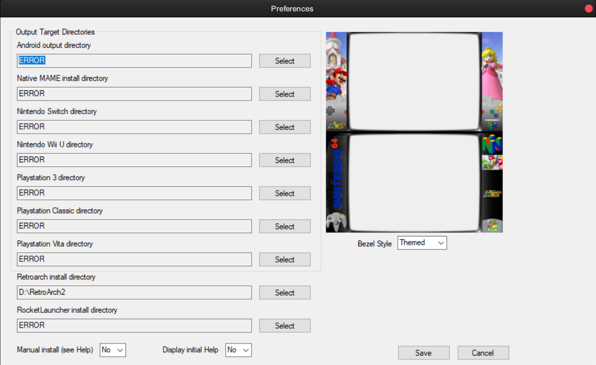
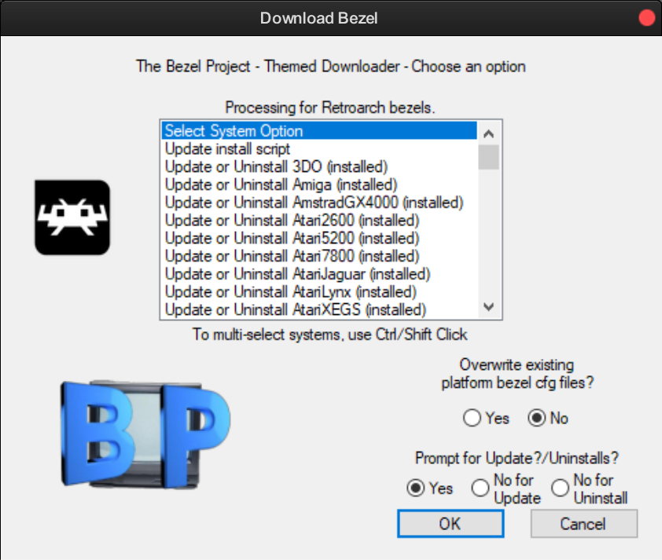

### Duimon - Bezel Project Presets
___

Thisis a full set of Mega Bezel presets designed to work with The Bezel Project's themed overlays. They will automatically load game overlays as backgrounds. There are Advanced, Standard, and Lite variations. For handheld systems there is a choice of either a CRT or LCD-GRID based preset.

For roms that do not have specific overlays, a default image will be loaded. (Most are the Bezel Project default overlays. A very few custom images or modifications were necessary.)

At least one of the systems (GameCube) has only the default overlay. If updates are made to the project, any updated graphics will work without changes to the presets.

The presets will require RetroArch 1.15.0 , and Mega Bezel V1.12.0_2023-03-11 or later.

### * Note * Your roms will need to match the No-Intro naming convention of the Bezels.

___

You will need to download The Bezel Project overlays. I recommend using the installer application from their GitHub repo.

[https://github.com/thebezelproject/](https://github.com/thebezelproject/)

___

Since we won't be using the overlays as "overlays", and we want the "themed" packages, a few options need to be selected.

### Preferences



Make sure to select "Themed" in the Bezel Style dropdown menu.

### Download



Select the "No" radio button to disable "Overwrite existing bezel cfg files."

Proceed to download your choice of Bezels.

___

There are two ways to install my pack. The release zip, or cloning the repo with git.

## Installation using the release zip

Download and unpack the release zip. Move the newly extracted "Duimon-Bezel-Project" folder to "shaders/Mega_Bezel_Packs". Create the "Mega_Bezel_Packs" folder first if one does not exist.

## Installation using git

You can install everything to a local clone and update using the following method.

1. Install Git. [https://git-scm.com/downloads](https://git-scm.com/downloads) using the default settings.
2. Enter the *"/Retroarch/shaders"* folder and create a *"Mega_Bezel_Packs"* folder if one does not exist.
3. Enter the *"Retroarch/shaders/Mega_Bezel_Packs"* folder and from the command-line run:

```
git clone https://github.com/Duimon/Duimon-Bezel-Project
```

It will create a *"Duimon-Bezel-Project"* folder inside the *"Mega_Bezel_Packs"* folder. 

To update, go into the *"Duimon-Bezel-Project"* folder (note the path difference) and run

```
git pull
```
___

Next, enter the "Duimon-Bezel-Project" folder and copy the contents of the "overlays" folder into the "Retroarch/overlays" folder. (This will not overwrite any files, the folders contain the default images.)
___
Finally, run some content, load the appropriate preset from the "Duimon-Bezel-Project/Presets" folder, and save a core preset. If you are using the same core for multiple systems, save a content directory preset.
___

If you have any issue or questions, please ask on my Libretro forum thread.

[https://forums.libretro.com/t/duimon-hsm-mega-bezel-graphics-and-presets-feedback-and-updates/28146](https://forums.libretro.com/t/duimon-hsm-mega-bezel-graphics-and-presets-feedback-and-updates/28146)